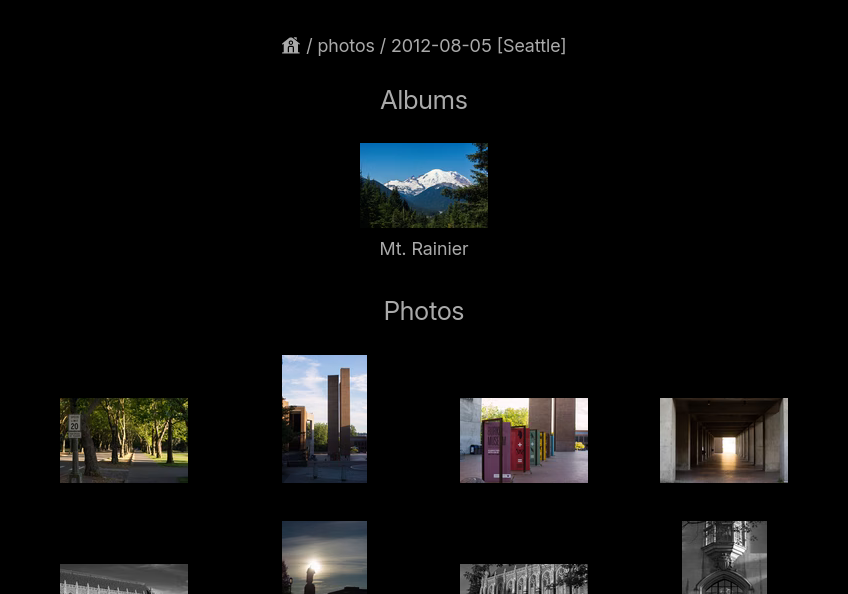

= NSGallery

A naively simple self-hosted photo gallery

== Introduction

NSGallery is a extremely simple photo gallery web service. Given a
directory, it presents the file structure of the directory as a set of
photos and albums. It is also “stateless”, meaning the program itself
does not persist any data. The outcome of running the program is
complete defined by the file structure, and configuration files.

== Deployment

NSGallery depends on ImageMagick and ExifTool.

Arch Linux users can build NSGallery using the
link:packages/arch/PKGBUILD[PKGBUILD] in the repo; otherwise

1. Build the binary using CMake.
2. Copy the binary to somewhere in `$PATH`.
3. Copy the `statics` and `templates` directory to a suitable place
(for example `/var/lib/nsgallery`).

Either way, you will want to create/edit the global configuration
file. NSGallery will look for the configuration file at
`/etc/nsgallery.yaml` by default, but you can put it anywhere and use
the `--config` command line option to change this path. An example
configuration is included link:packages/arch/nsgallery.yaml[here]. At
a minimum you will need to change the `photo-root-dir` to the
directory of photos you want to expose.

== Access Control

You can control when photo/sub-directory to expose/hide by createing a
`.nsgallery-config.yaml` in a directory where you need to control
access of. It has two modes of operation. You can put a `excludes` key
in it, and let it act as a blacklist. For example,

[source,yaml]
----
excludes:
  - photo1
  - some-directory
----

Suppose in the same directory as the YAML file is in, there is a file
named `photo1.jpg` and a sub-directory named `some-directory`, this
YAML file will forbid access to this photo and this sub-directory
(recursively), and they will not be listed in the album page. If a
visitor tries to access them (by manually figuring out and typing an
URL), it will be a 404 error. All other files and directories in the
same directory will be listed and accessible.

Note that in the YAML file, `photo1` does not come with the `.jpg`
extension name. In fact if you wrote the extension name it would not
work. Therefore, if in this directory you have `photo1.jpg` and
`photo1.png`, both of them are blocked. This is by design, and is
applicable to all other keys in `.nsgallery-config.yaml`.

You can also put an `includes` key instead of `excludes` in the YAML
file, which will act as a whitelist. Only the listed
photos/directories will be listed and accessible.

If there is no `.nsgallery-config.yaml` or there is not `includes` nor
`excludes`, it means everything is accessible.

You can also put a `hides` key in the file. This will allow access to
the photos and directories listed under the key, but they will not be
listed in the album page. A visitor will need to know the URL to see
them.
